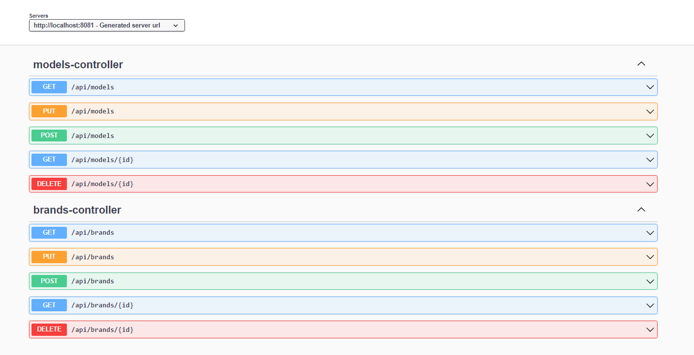

# rentACar
I have developed a basic structure that encompasses potential CRUD (Create, Read, Update, Delete) operations for a rent a car application. These CRUD operations represent functionalities that could be integrated into a complete rent a car application in the future. Utilizing Spring Boot and JPA with PostreSQL database integration, I have designed the ability to list car models and brands either based on the model or the brand. This foundational structure serves as an initial step towards the development of a rent a car application and can be expanded upon to add more features in the future.

